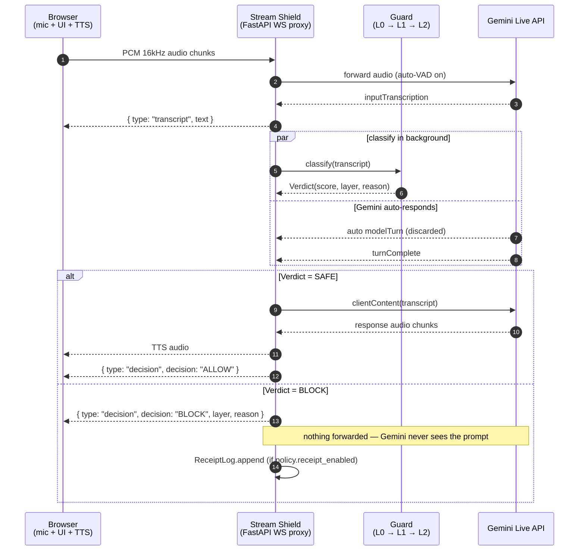

# Stream Shield

[](https://github.com/HDSH-hack/stream-shield/actions/workflows/ci.yml)

Streaming PI (prompt-injection) shield for Gemini Live API.
Hackathon implementation — 9 hours to working demo.

## What it is

A WebSocket proxy that sits in front of Gemini Live API:
- Intercepts streaming text and audio input from the browser.
- Runs layered classifiers (rule pass → Prompt Guard 2 → optional LLM judge).
- Blocks malicious input *before* it reaches Gemini.
- Forwards safe input transparently and streams the model's response back.

See [`UNIFIED_DESIGN.md`](./UNIFIED_DESIGN.md) for full architecture.

## End-to-end flow (one turn)



The classifier runs *during* Gemini's auto-VAD turn. By the time `turnComplete`
arrives, the verdict is ready — so safe input flows through with no wait, and
malicious input is dropped before any user-visible response is generated.

## Layout

```
stream-shield/
├── UNIFIED_DESIGN.md            # single source of truth
├── README.md                    # this file
├── docker-compose.yml           # local dev
├── backend/                     # FastAPI WebSocket proxy
│   ├── stream_shield/
│   │   ├── server.py            # WS handler
│   │   ├── gemini.py            # Gemini Live client
│   │   ├── protocol.py          # message parsing
│   │   ├── session.py           # ShieldSession
│   │   ├── buffer/              # Hold→Scan→Release + Response Buffer
│   │   ├── guard/               # L0 rules / L1 classifier / L2 judge
│   │   ├── policy.py            # per-entity YAML
│   │   ├── receipt.py           # Ed25519 sign chain (stretch)
│   │   ├── metrics.py
│   │   └── eval/runner.py       # attackset eval
│   ├── config/policy.default.yaml
│   ├── datasets/attackset.yaml
│   └── notebooks/
│       ├── gemini_live_poc.ipynb        # phase 0 timing PoC
│       └── promptguard_benchmark.ipynb  # model selection
├── frontend/                    # Next.js App Router + React
│   ├── app/
│   │   ├── page.tsx             # /
│   │   ├── demo/page.tsx        # /demo
│   │   ├── playground/page.tsx  # /playground
│   │   ├── metrics/page.tsx     # /metrics
│   │   ├── block-log/page.tsx   # /block-log
│   │   └── architecture/page.tsx # /architecture
│   ├── components/
│   └── lib/
├── sidecar/                     # (stretch) Ed25519 signing daemon
└── docs/
    ├── api.md
    └── individual-contributions/
        ├── eunjin.md
        ├── dohoon.md
        ├── soowon.md
        └── gihwang/             # design doc + diagrams + page mockups
```

## Quick start

### Backend
```bash
cd backend
uv venv && source .venv/bin/activate
uv pip install -r requirements.txt
export GEMINI_API_KEY=...
uvicorn stream_shield.server:app --reload --port 8000
```

### Frontend
```bash
cd frontend
pnpm install
cp .env.example .env.local
pnpm dev
```

브라우저에서 `http://localhost:3000` 접속 → Stream Shield frontend demo.

기본 WebSocket endpoint 는 `NEXT_PUBLIC_STREAM_SHIELD_WS_URL` 로 설정합니다.
로컬 기본값은 `ws://127.0.0.1:8000/ws` 입니다.

### Eval / per-entity comparison

```bash
cd backend
# Run the full attackset against one policy
python -m stream_shield.eval.runner --policy default
python -m stream_shield.eval.runner --policy hospital --json out.json

# Same input → different decisions across policies (the per-entity card)
python -m stream_shield.eval.compare
python -m stream_shield.eval.compare --diff-only
python -m stream_shield.eval.compare --inputs-from datasets/attackset.yaml --diff-only

# Tests
python -m unittest discover -s tests
```

See [`docs/eval-analysis.md`](./docs/eval-analysis.md) for current numbers and what they mean,
and [`docs/limitations.md`](./docs/limitations.md) for explicit non-goals.

## Contributors

- Eunjin (@foura1201) — design + classifier + buffer
- Gihwang (@hangole1999) — frontend mockups + parallel pipeline + diagrams
- Dohoon (@DoHoonKim8) — tiered cascade + policy-as-config
- Soowon (@swjng) — receipts + per-entity customization + comparison

## License

MIT (TBD).
